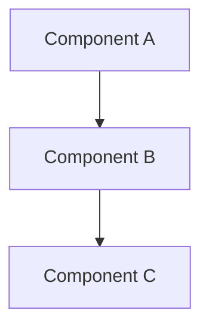

# Documentation Templates

Ready-to-use templates for each document type. Copy the relevant template and fill in the sections.

---

## Template: Tutorial

```markdown
# [Action]: [What You'll Build]

> **Time:** ~[N] minutes | **Level:** Beginner | **Prerequisites:** [list]

## What You'll Build

[One paragraph describing the end result. Include a screenshot description or expected output.]

## Before You Start

Make sure you have:
- [ ] [Prerequisite 1 — e.g., ".NET 10 SDK installed"]
- [ ] [Prerequisite 2 — e.g., "Harness repo cloned and building"]

## Step 1: [First Action]

[One clear action. Show the command or code change.]

```bash
[command to run]
```

You should see:
```
[expected output]
```

## Step 2: [Second Action]

[Continue the pattern — one action, one expected outcome per step.]

## Step 3: [Continue...]

[...]

## What You Built

[Celebrate! Summarize what they accomplished and what it means.]

## Next Steps

- [Link to a How-To guide for a related task]
- [Link to the Reference doc for the module they used]
- [Link to an Explanation doc if they want to understand the internals]
```

---

## Template: How-To Guide

```markdown
# How to [Accomplish Specific Task]

> **Audience:** [Who this is for] | **Prerequisites:** [What must be true]

## Overview

[One sentence: what this guide helps you do and when you'd need it.]

## Prerequisites

- [Requirement 1]
- [Requirement 2]

## Steps

### 1. [First Action]

[Instruction with code or configuration.]

### 2. [Second Action]

[Continue with concrete steps.]

### 3. [Verify]

[How to confirm it worked.]

```bash
[verification command]
```

Expected result:
```
[what success looks like]
```

## Troubleshooting

| Problem | Cause | Fix |
|---------|-------|-----|
| [Symptom 1] | [Why it happens] | [What to do] |
| [Symptom 2] | [Why it happens] | [What to do] |

## Related

- [Link to Reference doc for the APIs used]
- [Link to Explanation doc for architecture context]
```

---

## Template: Reference (Platform Module)

```markdown
# [Module Name] Module

> [One-line description of what this module does.]

## Overview

[One paragraph — purpose, key responsibilities, where it fits in the system.]

## Public Contracts

### [InterfaceName]

| Member | Type | Description |
|--------|------|-------------|
| `Method1()` | `Task<ReturnType>` | [What it does] |
| `Property1` | `string` | [What it represents] |

**Namespace:** `[Full.Namespace]`
**Source:** `[relative/path/to/file.cs]`

### [InterfaceName2]

[Repeat pattern for each public interface.]

## Key DTOs

### [DtoName]

| Field | Type | Default | Description |
|-------|------|---------|-------------|
| `Field1` | `string` | `""` | [Description] |
| `Field2` | `int` | `10` | [Description] |

## DI Registration

```csharp
// Registered by Add[Module]() in [File].cs
services.AddScoped<IInterface, Implementation>();
services.AddSingleton<IOtherInterface, OtherImpl>();
```

**Lifetime summary:**

| Service | Lifetime | Notes |
|---------|----------|-------|
| `IInterface` | Scoped | [Why this lifetime] |
| `IOtherInterface` | Singleton | [Why this lifetime] |

## Configuration

```json
{
  "[SectionName]": {
    "Property1": "default-value",
    "Property2": 30
  }
}
```

| Property | Type | Default | Description |
|----------|------|---------|-------------|
| `Property1` | `string` | `"default-value"` | [What it controls] |
| `Property2` | `int` | `30` | [What it controls] |

## Events & Integration

| Event | Payload | Published By | Consumed By |
|-------|---------|-------------|-------------|
| `[EventName]` | `[PayloadType]` | `[Publisher]` | `[Consumer]` |

## Database Schema

### [TableName]

| Column | Type | Nullable | Description |
|--------|------|----------|-------------|
| `Id` | `uuid` | No | Primary key |
| `Field1` | `text` | No | [Description] |

**Indexes:** `IX_[Table]_[Column]` on `[Column]`

## Usage Examples

### [Example 1 Title]

```csharp
// [What this example demonstrates]
[code snippet verified against current source]
```

### [Example 2 Title]

```csharp
[another example]
```

## Extension Points

| Extension | Interface | Purpose |
|-----------|-----------|---------|
| [Name] | `IExtensionPoint` | [How to extend] |
```

---

## Template: Explanation

```markdown
# [Concept or Decision Topic]

> Understanding [what this doc explains and why it matters].

## The Big Picture

[Start with a high-level overview. Use a diagram if it helps.]



## Why [This Approach]?

[Explain the reasoning. Discuss trade-offs. Reference alternatives.]

### What We Considered

| Approach | Pros | Cons | Why Not |
|----------|------|------|---------|
| [Option A] | [Benefits] | [Drawbacks] | [Reason for rejecting] |
| [Option B] | [Benefits] | [Drawbacks] | [Reason for rejecting] |
| **[Chosen]** | **[Benefits]** | **[Tradeoffs]** | **Selected** |

## How It Works

[Explain the mechanism. Walk through the flow conceptually, not as step-by-step instructions.]

## Key Concepts

### [Concept 1]

[Define and explain. Use an analogy if it genuinely helps.]

### [Concept 2]

[Continue for each important concept.]

## Implications

[What does this mean for developers building on this system?]

## Further Reading

- [Link to Reference doc for implementation details]
- [Link to Tutorial for hands-on learning]
- [Link to ADR for the formal decision record]
```

---

## Template: Architecture Decision Record (MADR)

```markdown
# [Number]. [Title] — [Proposed | Accepted | Deprecated | Superseded by ADR-N]

## Context and Problem Statement

[Describe the context and the problem that requires a decision. What forces are at play?
What is the current situation? Why can't we continue as-is?]

## Decision Drivers

- [Driver 1 — e.g., "Regulatory requirement for data residency"]
- [Driver 2 — e.g., "Team has deep PostgreSQL expertise"]
- [Driver 3 — e.g., "Must support 10K concurrent connections"]

## Considered Options

1. **[Option A]** — [one-line summary]
2. **[Option B]** — [one-line summary]
3. **[Option C]** — [one-line summary]

## Decision Outcome

Chosen: **[Option X]** because it [Y-statement connecting to decision drivers].

### Positive Consequences

- [Benefit 1]
- [Benefit 2]

### Negative Consequences

- [Tradeoff 1 — and how we'll mitigate it]
- [Tradeoff 2 — accepted risk]

## Pros and Cons of Each Option

### [Option A]

- ✅ [Pro 1]
- ✅ [Pro 2]
- ❌ [Con 1]
- ❌ [Con 2]

### [Option B]

- ✅ [Pro 1]
- ❌ [Con 1]

### [Option C]

- ✅ [Pro 1]
- ❌ [Con 1]

## Links

- [Related ADR]
- [Relevant spec or design doc]
- [External reference that informed the decision]
```

---

## Template: Product Documentation (User-Facing)

```markdown
# [Task-Oriented Title — e.g., "Reserva tu Estadía"]

> [One sentence: what the user will accomplish by reading this doc.]

## Antes de Empezar / Before You Start

[List what the user needs — account, app version, permissions, etc.]

## Paso a Paso / Step by Step

### 1. [First Action]

[Clear instruction. Describe what the user should see on screen.]

> 💡 **Tip:** [Helpful tip if applicable]

### 2. [Second Action]

[Continue with one action per step.]

### 3. [Verify Success]

[Tell the user what success looks like — confirmation screen, email, status change.]

## Preguntas Frecuentes / FAQ

**Q: [Common question 1]**
A: [Clear answer]

**Q: [Common question 2]**
A: [Clear answer]

## ¿Necesitas Ayuda? / Need Help?

[Contact information, support channels, or links to related guides.]

## Relacionado / Related

- [Link to related guide]
- [Link to feature overview]
```
